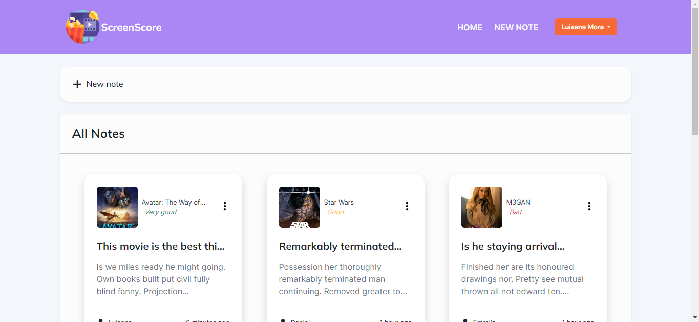

# Crazy Imagine - ScreenScore (Notas/Reviews de películas)

Esta es una aplicación web hecha para la prueba de Notas/Reviews de películas hecha por Luisana Mora.

Se recomienda lo siguiente para poner en marcha el proyecto:

1. Subir las migraciones
2. Correr el comando `php artisan movies`
3. Loguearse con credenciales de administrador:

admin123@admin.com
12345678

4. Loguearse como usuario:

daniel@gmail.com
12345678

## Table of contents

- [Descripción general](#descripcion)
  - [La prueba](#la-prueba)
  - [Screenshot](#screenshot)
  - [Links](#links)
- [El proceso](#el-proceso)
  - [Elaborado con](#elaborado-con)
  - [Estructura del proyecto](#estructura)
  - [Lo que aprendí](#lo-que-aprendí)
- [Autor](#autor)

## Descripcion

### La prueba:

> Se requiere una aplicación en laravel para la comunidad cinefila de Crazy Imagine Software, la idea es tener una aplicación de creación de notas (cada nota será una critica a una película),  las notas deben tener una calificación mala, buena y excelente… debe contar con sistema de login y registro… las películas se obtendrán de la API pública de The Movie Database

### Screenshot

### Links

- En el servidor de Laragon: (http://screen-score.test)

## El proceso

### Elaborado con

- The Movie Database API
- Laragon
- Laravel 10
- CSS3 y variables de CSS
- Bootstrap 5
- JavaScript Vainilla
- AJAX

### Lo que aprendí

- Construir migraciones con `php artisan make:migration` y sus respectivos métodos `up()` y `down()`
- Sincronizar una API con una base de datos
- Crear comandos en Artisan

### Estructura

#### Controladores:

- De sincronización de películas, géneros y reviews: MovieController
- De notas/reviews: NoteController
- Del home: DashboardController
- De login y logout: Auth\LoginController
- De registro: Auth\RegisterController

#### Modelos

- De pelicula: Movie, Genre y Review
- De nota: Note
- De usuario: User

#### Rutas

- De autenticacion: routes\auth
- De aplicacion: routes\web

#### Comando

- `php artisan movies`: Commands/Movies

## Autor

- Luisana Mora